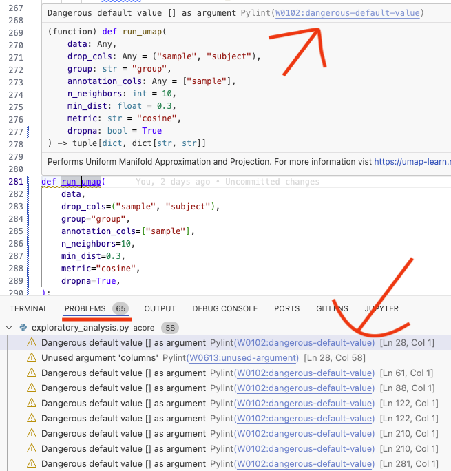
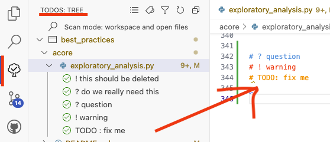

# Coding (best) practices for Data Science

> Author: Henry Webel

Being asked to show some coding best practices for an internal retreat, I assembeled
some low hanging fruits in reach for everyone and some pratices I learned to appreciate.

## Use a formater

When you write code, you should at least use some sort of formatter. `black` is common choice
as it allows you to format code in a user-defined linelength consistently. It even can
break too long strings into it's parts - leaving only long comments and docstrings to you
for adoption.

`black` or `autopep8` are also availbe next to `isort` for sorting imports in VSCode as 
extension, so your files are formatted everytime you save these 
([link](https://code.visualstudio.com/docs/python/formatting)).

You can configure black and isort e.g. in your `pyproject.toml` file to process long strings
and enable the next release features:

```toml
[tool.black]
line-length = 90
preview = true
enable-unstable-feature = ["string_processing",]

[tool.isort]
profile = "black"
```

## Use a linter

Too long lines, unpassed arguments or mutable objects as default function parameters you can
identify using a linter like `flake8` or `ruff`. Tools like 
[`Pylint` in VSCode](https://code.visualstudio.com/docs/python/linting)
allow you to get in editor highlighting of Code issues and links with hints on how to fix them


Example: Using the linter you can for example if you did not pass an argument to a function
as was fixed in this commit [18b675](https://github.com/Multiomics-Analytics-Group/acore/pull/2/commits/18b67516b25de30cf6fd4bb640422aa8e0642b08) in `run_umap` (you will need to unfold the first file to see the full picture).


## Better Comments and ToDo Trees

[Better Comments](https://marketplace.visualstudio.com/items?itemName=aaron-bond.better-comments)
allows you to highlight comments in code using different colors 
`# ? warning` or `# ? question` or `# TODO` . If you add `?` and `!` to the list of expression to list
in a
[ToDo Tree](https://marketplace.visualstudio.com/items?itemName=Gruntfuggly.todo-tree) 
you can easily keep a list of todos in your code - allowing you to go 
through them from time to time and prioritze.



## Text based Notebook (percent format) with jupytext and papermill

[`jupytext`](https://jupytext.readthedocs.io/) is a lightweight tool to keep scripts either as notebooks (`.ipynb`) or simpler text based file formats, such as markdown files (`.md`)  which can be easily rendered on GitHub or python files  (`.py`) which can be executed in VSCode’s interactive shell and are better for version control. Some tools still need ipynb to work, e.g. `papermill`. Therefore it is handy to keep different version of a script in sync. Otherwise one can also only use python files and render these as notebook in e.g. 
[jupyter lab](https://jupytext.readthedocs.io/en/latest/text-notebooks.html). Especially if the code is only kept for version control, but executed versions are keep in a project folder using a workflow environment (as `snakemake` or `nextflow`) this comes in handy.

You can see an example of the percent notebook in the [percent_notebooks](project:percent_notebooks.py) section.

I showed how to sync a text based percent notebook and execute it using `papermill`
(without) specifying arguments on the commmand line:

```bash
jupytext --to ipynb -k - -o - example_nb.py | papermill - path/to/executed_example.ipynb
```

If you want to keep some formats in sync and only sync one of these and only push one type to git 
- specifying e.g. a `.gitignore` the types you want to only have locally.
Each folder can have a `.jupytext.toml` file to specify the formats you want to keep in sync
in that folder e.g.:

```toml 
# percent format and ipynb format in sync
formats = "ipynb,py:percent"
```

## Copilot in VSCode

Ghosttext, chats and inline chats are great ways to get suggestions on the code you are 
writing. You can apply for a free version as a [(PhD) student](https://github.com/education/students)
or [instructor](https://github.com/education/teachers). Currently alternatives wit a free-tier as [codium](https://codeium.com/) are also available.

